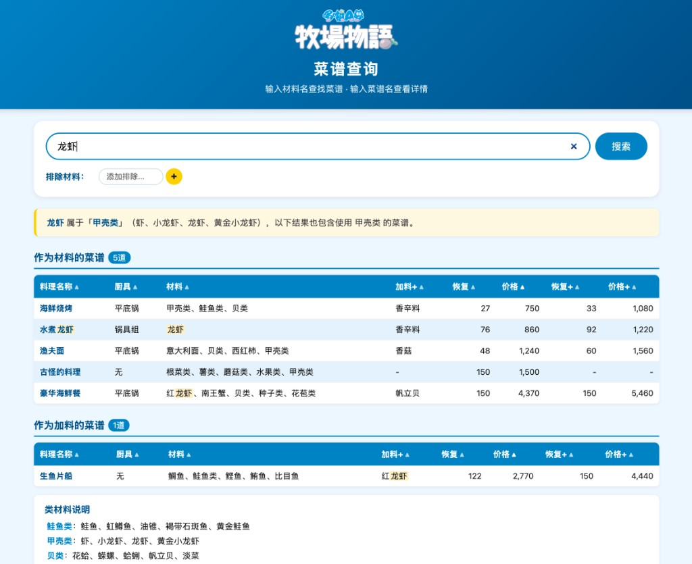

# 哆啦A梦牧场物语 菜谱查询工具

## Doraemon Story of Seasons - Recipe Search Tool

**在线使用 / Live Demo:** [https://delilah1230.github.io/Doraemon_story_of_seasons/](https://delilah1230.github.io/Doraemon_story_of_seasons/)

---

---

### 简介

一个为《哆啦A梦 牧场物语》玩家打造的菜谱查询工具，支持按材料或菜谱名搜索，帮助你快速找到想做的料理。

### Introduction

A recipe search tool for *Doraemon Story of Seasons* players. Search by ingredient or dish name to quickly find the recipe you need.

---

### 功能 / Features

- **材料搜索 / Ingredient Search** — 输入材料名，列出所有使用该材料的菜谱 / Search by ingredient to find all recipes using it
- **菜谱名搜索 / Recipe Name Search** — 输入菜谱名或关键词，查看菜谱详情 / Search by dish name or keyword for recipe details
- **类别自动扩展 / Category Auto-Expansion** — 搜索单个素材时自动关联其所属类别（如搜"虾"也会显示"甲壳类"菜谱）/ Searching an item automatically includes its category (e.g. searching "shrimp" also shows "crustacean" recipes)
- **排除材料 / Exclude Ingredients** — 支持排除多个材料或类别，过滤搜索结果 / Exclude multiple ingredients or categories from results
- **价格排序 / Price Sorting** — 点击表头按价格、体力等排序 / Click column headers to sort by price, HP, etc.
- **类材料说明 / Category Details** — 自动列出结果中"类"材料包含的具体素材 / Automatically lists individual items within category ingredients

### 数据 / Data

- 共收录 **136 道菜谱**，涵盖平底锅、锅具组、打蛋器、擀面杖、烤箱及无厨具料理
- 包含 **24 种素材分类**
- 136 recipes covering all utensil types: frying pan, pot set, whisk, rolling pin, oven, and no-utensil dishes
- 24 ingredient categories included

### 使用方式 / How to Use

1. 在线访问 / Visit online: [https://delilah1230.github.io/Doraemon_story_of_seasons/](https://delilah1230.github.io/Doraemon_story_of_seasons/)
2. 或下载 `index.html` 文件，用浏览器直接打开（无需网络）/ Or download `index.html` and open in any browser (works offline)

### 技术 / Tech

纯前端单文件 HTML，无需服务器、无外部依赖。所有数据内嵌于 JavaScript 中。

Single self-contained HTML file. No server required, no external dependencies. All data embedded in JavaScript.

---

### 制作信息 / Credits

- **制作者 / Made by:** 绫波大白丽_
- **牧场名 / Farm:** 万物有滚牧场
- **菜谱数据来源 / Recipe data source:** 小红书 ID: eternal（小红书号: 369356798）
